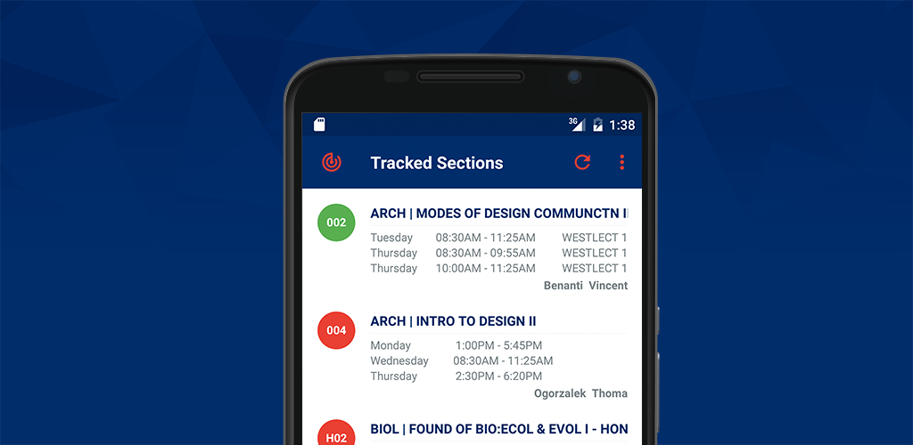

# NJIT Course Tracker


<p align="center">
    <a href="https://play.google.com/store/apps/details?id=com.tevinjeffrey.njitct"></a>
</p>


## Requirements

- [Android SDK](http://developer.android.com/sdk/index.html).
- Android [6.0 (API 23) ](http://developer.android.com/tools/revisions/platforms.html#6.0).
- Android SDK Tools (Gradle 1.5+)
- Android SDK Build tools 23.0.2
- Android Support Repository
- MinSdkVersion 15

## Libraries

The libraries and tools used include:

- Support library
- RecyclerView
- [RxJava](https://github.com/ReactiveX/RxJava) and [RxAndroid](https://github.com/ReactiveX/RxAndroid) 
- [Retrofit 1.9](http://square.github.io/retrofit/) and [OkHttp](https://github.com/square/okhttp)
- [Dagger 1](http://google.github.io/dagger/)
- [Butterknife](https://github.com/JakeWharton/butterknife)
- [Timber](https://github.com/JakeWharton/timber)
- [AppIntro](https://github.com/PaoloRotolo/AppIntro)
- [material-icon-lib](https://github.com/code-mc/material-icon-lib)
- [Otto](http://square.github.io/otto/) 
- [Once](https://github.com/jonfinerty/Once)
- [IcePick](https://github.com/frankiesardo/icepick)
- [Sugar](https://github.com/satyan/sugar)
- [Material Dialogs](https://github.com/afollestad/material-dialogs)

and [more...](https://github.com/tevjef/Rutgers-Course-Tracker/blob/master/app/src/main/res/raw/open_source_licenses.json)

# Licence

```
Copyright 2015 Tevin Jeffrey.

Licensed under the Apache License, Version 2.0 (the "License");
you may not use this file except in compliance with the License.
You may obtain a copy of the License at

    http://www.apache.org/licenses/LICENSE-2.0

Unless required by applicable law or agreed to in writing, software
distributed under the License is distributed on an "AS IS" BASIS,
WITHOUT WARRANTIES OR CONDITIONS OF ANY KIND, either express or implied.
See the License for the specific language governing permissions and
limitations under the License.
```
